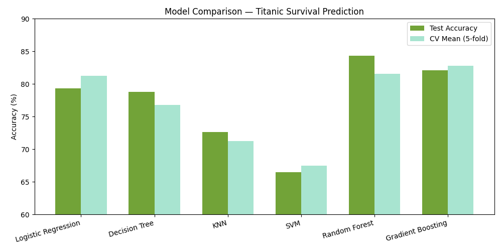
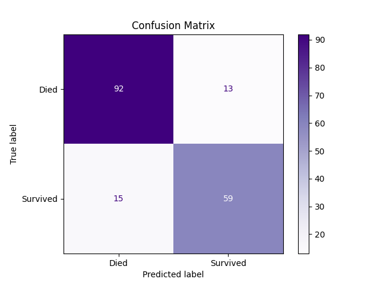
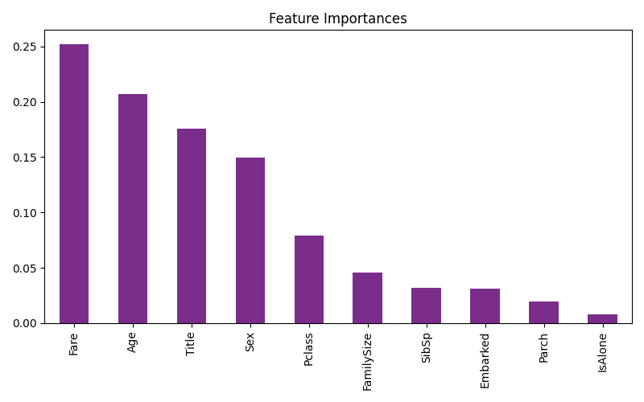
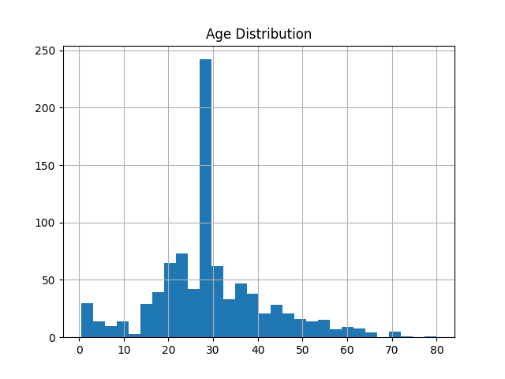

# 🚢 Titanic Survival Prediction

A machine learning project that predicts whether a passenger survived the Titanic disaster using Python and Scikit-learn.

---

## 📌 Dataset

- **Source:** [Kaggle Titanic Dataset](https://www.kaggle.com/competitions/titanic)
- **Rows:** 891 passengers
- **Target:** `Survived` — 0 (No) / 1 (Yes)

---

## 🔧 Tech Stack

`Python` · `Pandas` · `Scikit-learn` · `Matplotlib` · `Seaborn`

---

## 🤖 Model

Multiple models were compared before selecting the final one.

| Model | Test Accuracy | CV Mean |
|---|---|---|
| SVM | 66.5% | 67.5% |
| KNN | 72.9% | 71.2% |
| Decision Tree | 79.1% | 76.8% |
| Logistic Regression | 79.6% | 81.4% |
| Gradient Boosting | 82.1% | 82.7% |
| **Random Forest** ✅ | **84.4%** | **81.5%** |

**Random Forest** was selected as the final model — it achieved the highest test accuracy of 84.4% with a consistent CV mean of 81.5%, confirming it generalises well on unseen data.

**Features used:** `Pclass`, `Sex`, `Age`, `Fare`, `Embarked`, `FamilySize`, `IsAlone`, `Title`

## 📊 Visualizations

### Model Comparison


### Confusion Matrix


### Feature Importance


### Age Distribution


---

## 📊 Results

| Metric | Score |
|---|---|
| Test Accuracy | **84.4%** |
| CV Mean (5-fold) | **81.5%** |
The model performed better at predicting non-survivors compared to survivors, as seen in the confusion matrix.

---

## 💾 Model Saving

The trained model was saved using Joblib and can be reused for predictions without retraining.

---

## 🚀 Run Locally

```bash
pip install pandas scikit-learn matplotlib seaborn
Titanic_Survival_Prediction.ipynb
```

---

## 👤 Author

**Shreyas** · [GitHub](https://github.com/your-username) · [LinkedIn](https://linkedin.com/in/your-username)

---

*Built as part of a machine learning internship task.*
